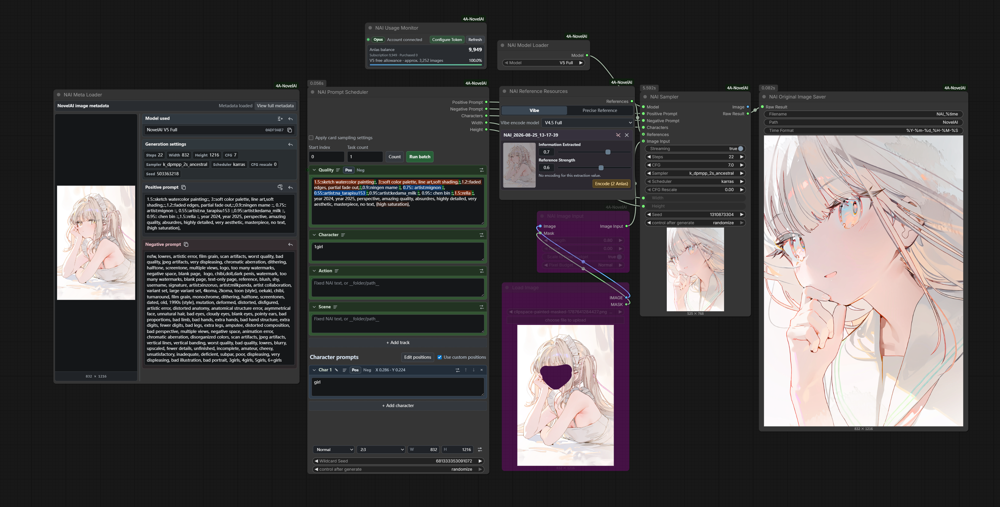
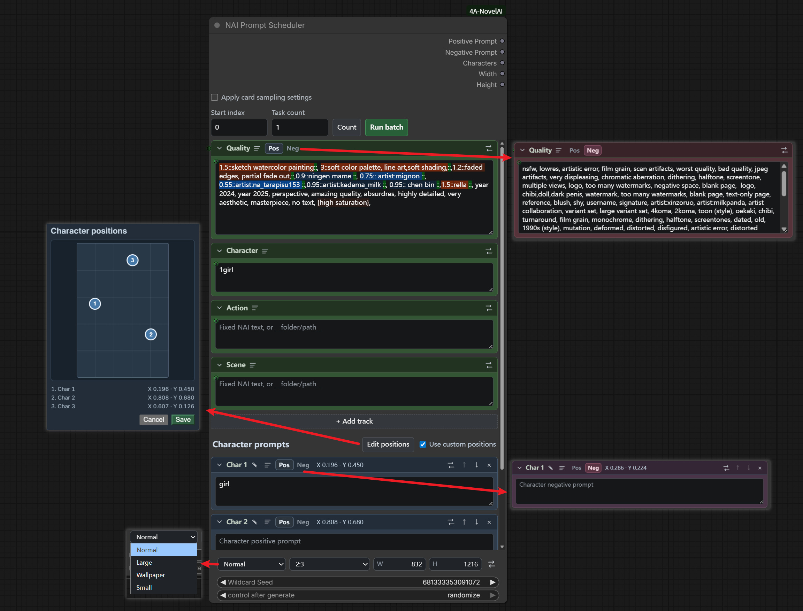
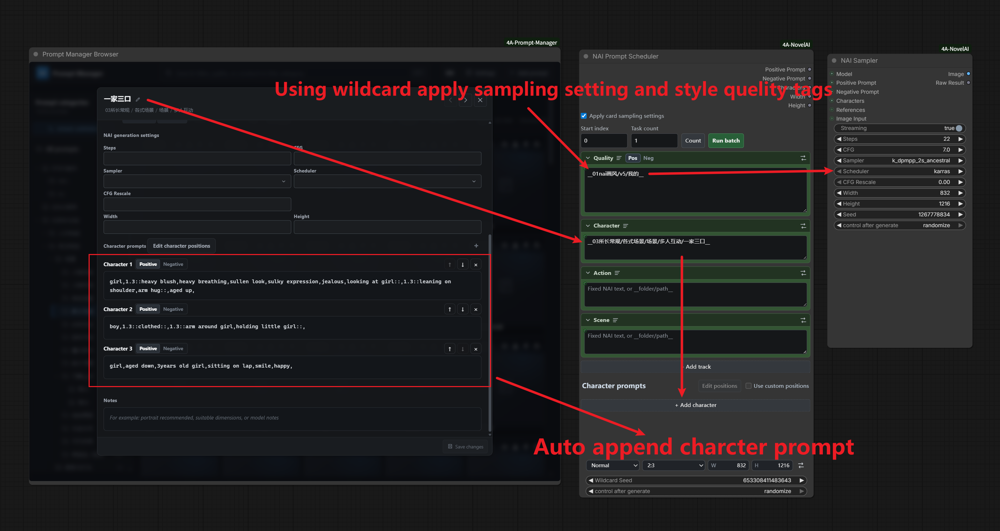
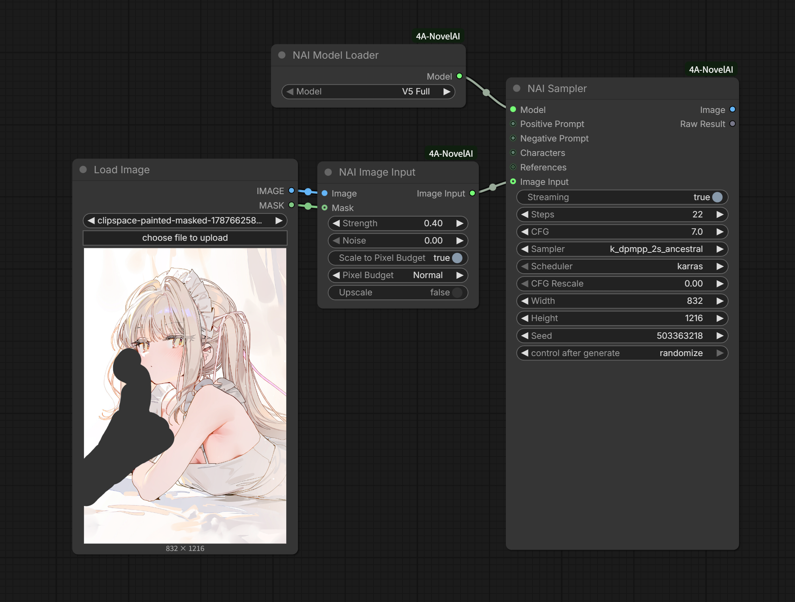
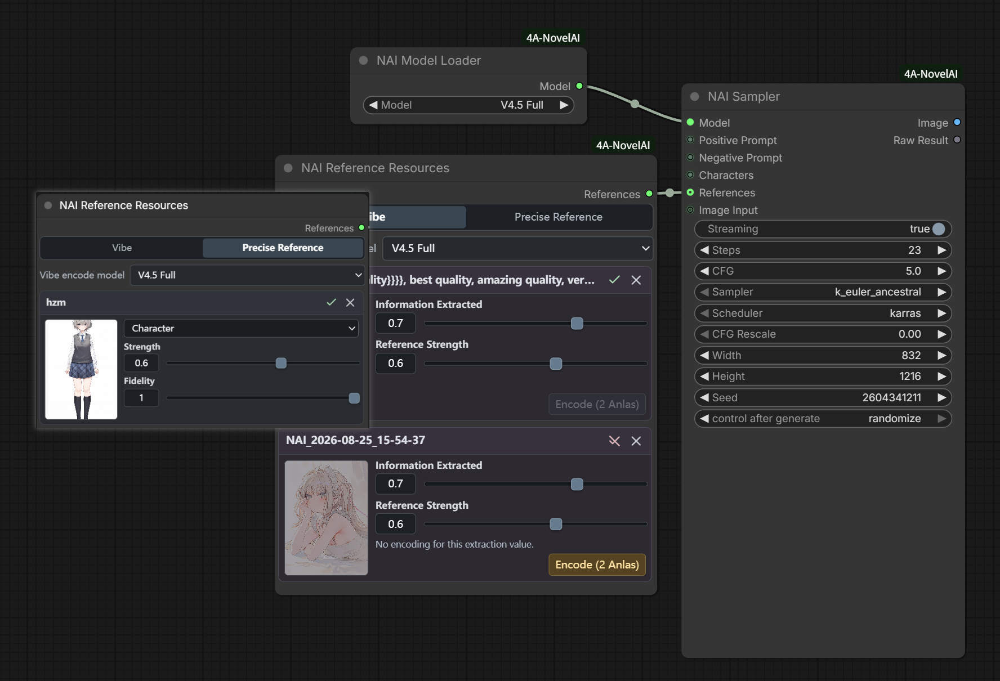
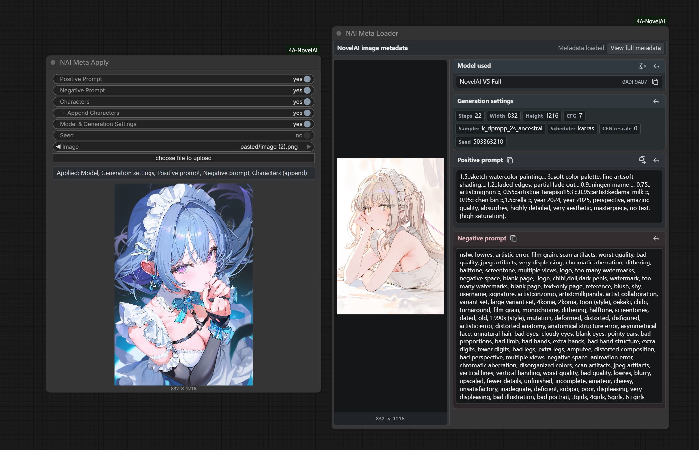
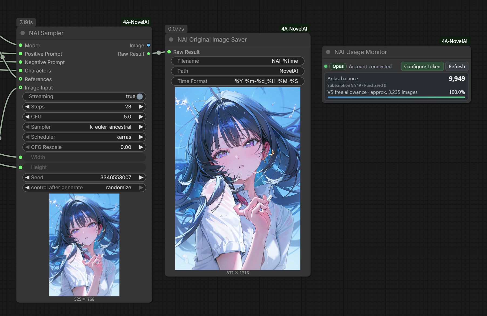

# ComfyUI-4A-NovelAI

[English](README.md)

配套提示词库：[ComfyUI-4A-Prompt-Manager](https://github.com/tsukino4a/ComfyUI-4A-Prompt-Manager)

面向 ComfyUI 的独立 NovelAI 生图插件，仅支持 NovelAI Diffusion V4.5 及之后的模型。提供 NAI 原生提示词调度、多角色提示词、文生图 / 图生图 / 局部重绘、Vibe 与精准参考、元数据复用、账户额度监控，以及不重新编码的 NovelAI 原始 PNG 保存。

**当前版本：1.0.0** — 4A NovelAI 独立生图工作流的首个完整版本，提供中英文界面，并可选联动 4A Prompt Manager。

> 本项目是非官方社区扩展，与 NovelAI 官方无隶属关系。生成、Vibe 编码与参考功能可能按 NovelAI 账户及当前 API 规则消耗 Anlas；请使用自己的 Persistent API Token。

<p align="center">
  
</p>

## 亮点

### NAI 原生提示词调度与多角色提示词

提示词编辑器完整保留 NovelAI 原生 `{}`、`[]`、`N::text::` 权重语法。选中文字后输入 `{`、`[` 或 `:`，会自动补齐对应闭口；嵌套权重与数值权重会直接在调度器中着色显示。

#### 正面 / 负面切换

质量、角色、动作、场景和角色卡片都可以在原位置切换正面与负面提示词。两种状态使用不同配色，在不复制整套布局的情况下紧凑管理正负两面。

#### 角色便捷定位

可在所选模型上限内添加多张有序角色卡片。角色位置可以保持自动，也可以直接在对应画面比例的定位画布中快速排列；手动位置会保存为每个角色归一化的 `x/y` 坐标。

#### 像素预算控制

选择小图、普通、大图或壁纸档位时会保留当前画面比例，也可以手动编辑自定义宽高。角色定位画布使用同一组实际尺寸，因此坐标与最终生成画面一致。

#### 固定提示词批量运行

设置起始位置和任务数量后，可从调度器一次性把整批任务加入 ComfyUI 队列，用当前固定提示词连续出图。入队后仍由 ComfyUI 一张张执行。Wildcard 的随机 / 顺序换提示词需要安装 4APM，见下一节。

<p align="center">
  
</p>

### 4A Prompt Manager Wildcard 联动

当 [4A Prompt Manager](https://github.com/tsukino4a/ComfyUI-4A-Prompt-Manager) 与本插件并列安装时，NAI 提示词调度器会通过只读联动访问它的文件夹 TXT / JSON 卡片库与卡片原生 `nai` 字段。栏目可贴 `__文件夹__` / `__路径/文件__`，并按随机或顺序切换提示词：顺序模式可先统计叶子数量，再一次性入队整批任务。这里只支持最基础的 `__wildcard__` 写法；花括号不会被当作随机选项，因为它在 NovelAI 提示词中本身具有独立含义。

通配符选择种子与 NAI 采样器的生图种子相互独立。调度器批量过程中可临时应用 NAI 卡片中的稀疏采样设置，并在任务完成后恢复；4APM 也可以把原生 NAI 提示词、角色卡片和受支持的元数据字段发送到独立 NAI 节点。未安装 4APM 时，`__wildcard__` 不会展开，批量只会重复当前固定提示词，其余生图节点仍可正常使用。

<p align="center">
  
</p>

### 一个采样器覆盖文生图、图生图与局部重绘

NAI 采样器分别接收正面提示词、负面提示词、角色 JSON、模型、采样参数、分辨率与可选参考资源。它支持 NovelAI 流式接口的实时进度预览，并同时输出标准 ComfyUI `IMAGE` 与未经改写的原始 PNG 字节 `NAI_RESULT`。

连接 NAI 图像输入后，模式看的是图和遮罩里有没有内容，而不是线有没有接上：

- 没有图像：按照调度器 / 采样器尺寸进行文生图。
- 有图像、遮罩为空或未画：图生图。空遮罩可以留在节点上，不必断开。
- 有图像且遮罩里有笔画：局部重绘。

进入后两种模式后，生成尺寸由 NAI 图像输入负责。它始终保留原图比例，可选择缩放到小图 / 普通 / 大图 / 壁纸预算像素量，按官方 Enhance 1.5 规则放大（每边先乘 1.5，再向上取整到 64），或采用接近原图的像素量。放大与缩放到预算像素量互斥，避免被采样器里无关的宽高意外拉伸。

<p align="center">
  
</p>

### Vibe 与精准参考卡片

可将图片或 `.naiv4vibe` 文件直接拖入 NAI 参考资源节点。一个多卡片界面管理 Vibe 或精准参考，两种模式保持互斥；精准参考卡片可选择角色、风格或角色与风格。

图片 Vibe 会优先复用匹配的本地编码。缺少编码时不会静默付费：必须手动点击“编码并保存”并确认后才会请求编码。V5 当前会静默忽略已连接的参考资源，符合当前 V5 工作流预期；V4.5 才会使用所配置的 Vibe 或精准参考卡片。

<p align="center">
  
</p>

### NovelAI 元数据查看与一键应用

NAI 元数据加载器沿用 4APM 的元数据卡片布局，完整显示 NovelAI 图片中的模型、生成参数、正面提示词、负面提示词，并为每个角色建立独立卡片。可以单独发送模型、参数、提示词或追加单个角色；“发送所有提示词”会替换完整提示词与角色集合。

NAI 元数据一键应用只接受 NovelAI 原图，可分别开关正面提示词、负面提示词、角色、追加角色、模型与生成参数、种子。应用模型和生成参数时刻意不覆盖分辨率；只应用正面提示词时，会保留调度器已有的角色、动作和场景栏目。非 NAI 图片仍可查看正负面文本，但不会把其模型和推理参数当作 NovelAI 设置解析。

<p align="center">
  
</p>

### 本地 Token、额度监控与原始 PNG 保存

可在 **设置 → 4A NovelAI → 账户 → Token 与 Anlas** 或 NAI 用量监控节点中配置 Persistent API Token。Token 只发送到本机 ComfyUI 后端，并保存在工作流之外：

```text
<ComfyUI user>/ComfyUI-4A-NovelAI/credentials.json
```

Token 不会写入工作流、生成图片元数据、浏览器设置或插件日志。NAI 用量监控会显示订阅等级、订阅与购买 Anlas，以及当前 V5 免费额度。NAI 原图保存节点把 NovelAI 返回的 PNG 直接写入 ComfyUI output，不重新编码并保留服务端元数据。

<p align="center">
  
</p>

## 安装

### ComfyUI-Manager

搜索 **4A NovelAI** / `ComfyUI-4A-NovelAI` 安装。Manager 会处理 `requirements.txt` / `install.py`。

### 手动安装

```bash
cd ComfyUI/custom_nodes
git clone https://github.com/tsukino4a/ComfyUI-4A-NovelAI.git ComfyUI-4A-NovelAI
cd ComfyUI-4A-NovelAI
python install.py
# 或: pip install -r requirements.txt
```

安装后重启 ComfyUI。`msgpack` 是必装依赖，用于读取 NovelAI 官方 Vibe 文件；requests、Pillow、NumPy 与 PyTorch 由 ComfyUI 提供。

## 快速开始

1. 添加 **NAI 模型加载器**、**NAI 提示词调度器**、**NAI 采样器**和 **NAI 原图保存**。
2. 将调度器的正面、负面、角色、宽度、高度五路输出连接到 NAI 采样器；连接模型加载器，并把 `NAI_RESULT` 接到原图保存节点。
3. 从 NAI 用量监控或 ComfyUI 设置中配置 Token。
4. 在调度器中填写固定提示词；安装 4APM 后也可以使用 `__wildcard__`。按需添加角色卡片，然后运行采样器。
5. 可选连接 NAI 参考资源或 NAI 图像输入。需要多张同一提示词时，使用调度器的“批量运行”；安装 4APM 后，栏目里的 Wildcard 才会按随机或顺序换提示词。

## 节点一览

| 节点 | 作用 |
|------|------|
| NAI 模型加载器 | 选择 V5 Full、V5 Curated、V4.5 Full 或 V4.5 Curated |
| NAI 用量监控 | 配置 Token，显示订阅、Anlas 与 V5 免费额度 |
| NAI 提示词调度器 | 拼装原生 NAI 提示词、角色、坐标、分辨率与固定提示词批量 |
| NAI 参考资源 | 管理互斥的 Vibe 或精准参考卡片 |
| NAI 图像输入 | 管理底图、遮罩、强度、噪声与分辨率；空遮罩仍按图生图处理 |
| NAI 采样器 | 提交文生图、图生图或局部重绘请求，并输出解码图像与原始结果 |
| NAI 原图保存 | 不重新编码地保存 NovelAI 原始 PNG |
| NAI 元数据加载器 | 查看元数据，并将单项或组合内容发送到 NAI 节点 |
| NAI 元数据一键应用 | 从拖入或选择的图片应用指定 NovelAI 元数据字段 |

## 示例工作流

在 ComfyUI 中加载 [`example_workflows/01_basic_novelai_workflow.json`](example_workflows/01_basic_novelai_workflow.json)，即可使用“模型加载器 → 提示词调度器 → 采样器 → 原图保存”的基础工作流。入队前请先选择模型并配置 Token；需要时再添加参考资源或图像输入节点。

## 分辨率档位

| 档位 | 竖图 | 方图 | 横图 |
|------|------|------|------|
| 小图 | 512 × 768 | 640 × 640 | 768 × 512 |
| 普通 | 832 × 1216 | 1024 × 1024 | 1216 × 832 |
| 大图 | 1024 × 1536 | 1472 × 1472 | 1536 × 1024 |
| 壁纸 | 1088 × 1920 | — | 1920 × 1088 |

自定义尺寸范围为 64–2048，步长为 64。NAI 图像输入始终根据原图比例计算实际尺寸，不会无条件复制采样器宽高。放大 1.5 使用 `ceil(边 × 1.5 / 64) × 64`，某一边超过 2048 时再等比收回。

## 兼容与行为边界

- 可选模型：V5 Full、V5 Curated、V4.5 Full、V4.5 Curated。
- V5 会静默忽略已经连接的 Vibe / 精准参考资源。
- V5 Curated 局部重绘按照当前 NovelAI 客户端行为路由到 V4.5 Curated inpainting，因此该模式保持最多六个角色。
- 仅普通像素预算以内、最多 28 步、单张且不含付费参考功能的文生图会在暂时性故障后自动重试。大图/壁纸、图生图、局部重绘、超过 4 个 Vibe、精准参考和 Vibe 编码均只发送一次。
- 未安装 4APM 时调度器不展开 `__wildcard__`。安装后也只展开普通 `__wildcard__`；NovelAI 的花括号与方括号始终作为原生提示词语法保留。
- 前端界面和节点定义均提供中文与英文本地化。

## 依赖

- **必需：** [`msgpack`](https://pypi.org/project/msgpack/)，用于 NovelAI 官方 Vibe 文件
- requests、Pillow、NumPy、PyTorch 与 aiohttp 由 ComfyUI 提供
- **可选联动：** [ComfyUI-4A-Prompt-Manager](https://github.com/tsukino4a/ComfyUI-4A-Prompt-Manager)，提供文件夹 Wildcard / JSON 卡片库与元数据发送桥接

## 许可证

本项目以 [MIT License](LICENSE) 发布。
